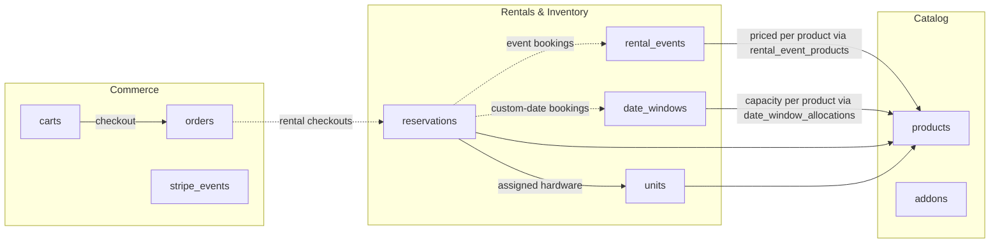
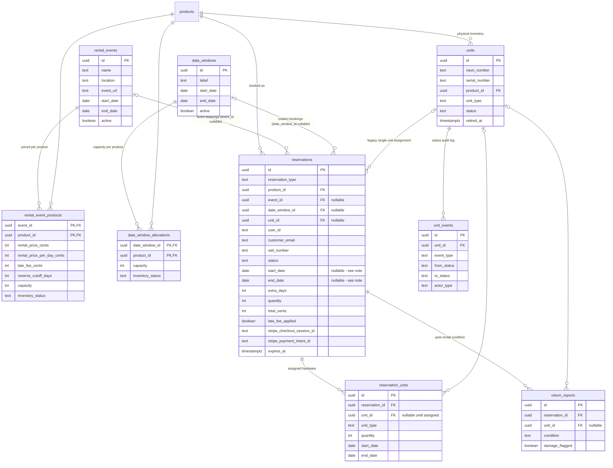
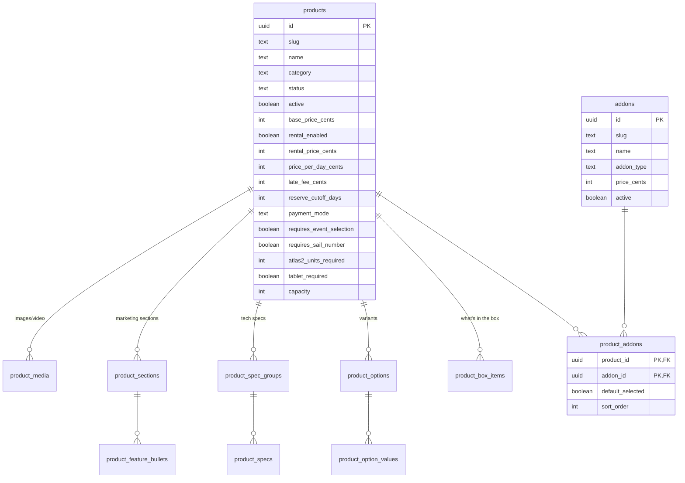
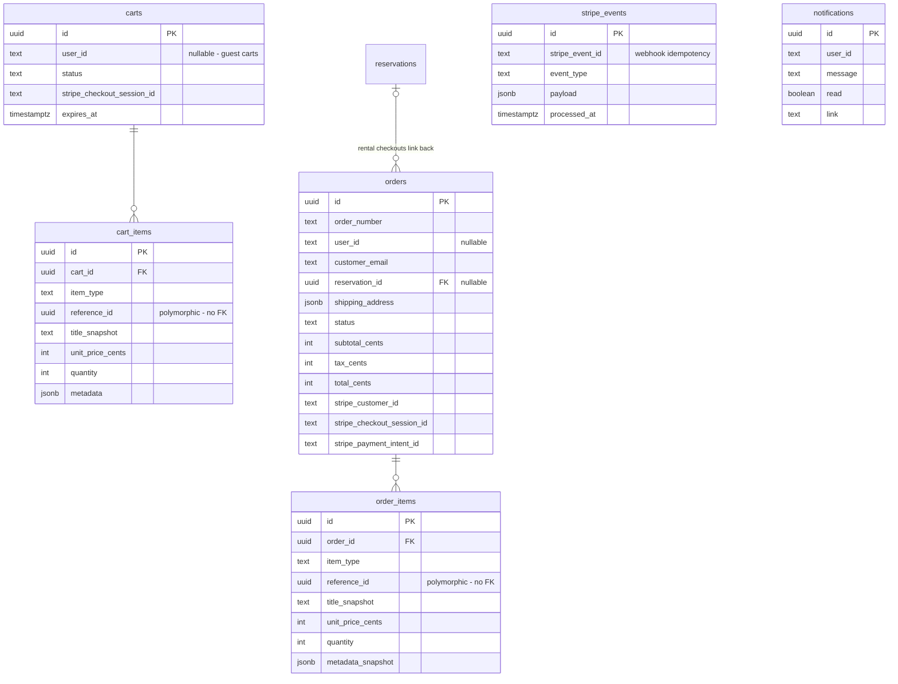

# NAVO Marine — Database ERD

Generated 2026-07-17 from the live Supabase schema (`public`, project `fdjuhjadjqkpqnpxgmue`). 26 tables, grouped into three domains: **Catalog**, **Rentals & Inventory**, and **Commerce**.

There is no `users` table — auth is JWT-only (NextAuth), so `user_id` / `customer_email` columns are plain `text` references to the session identity, not foreign keys.

## Big picture

## Rentals & Inventory (the /reserve flow)

> **Date semantics gotcha (bit us in PR #24):** `reservations.start_date`/`end_date` are only populated for some reservation types. For event bookings the dates live on `rental_events`; for date-window bookings they live on `date_windows`. Always coalesce: `coalesce(reservations.end_date, rental_events.end_date, date_windows.end_date)`.

## Catalog (products & merchandising)

## Commerce (carts, orders, Stripe)

## Notes on soft links

- `cart_items.reference_id` / `order_items.reference_id` are **polymorphic** — they point at a product, addon, or reservation depending on `item_type`, with no DB-level foreign key.
- `stripe_events` and `notifications` are standalone (no FKs) — the former is the webhook idempotency ledger, keyed by `stripe_event_id`.
- `reservations.unit_id` is a legacy single-unit pointer; multi-unit assignment now goes through `reservation_units`.
